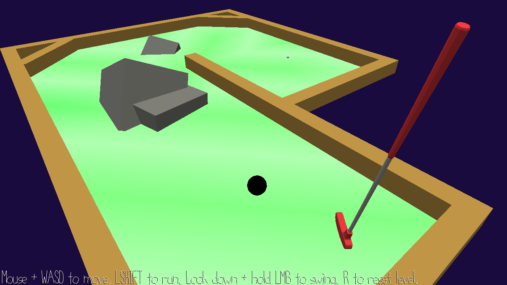

# Black Hole-in-One

Author: Andrew Knowles

Design: This game is like mini-golf, except rather than hitting a ball towards a hole, you hit a (black) hole towards a ball. The gravity of the black hole can be helpful as the ball will start to fall in as you get close, so try to pick up items to increase the hole's mass.

Screen Shot:

How To Play:

WASD and mouse for move/look. If you look down, you can click left mouse button and release to swing, with more power based on how long you hold. You need to be standing over the black hole to hit it. Also, shift to run and R to restart level ("penalty stroke"). The game assumes a right-handed stance, meaning swinging on the hole will send it to your left. See how few shots you need to get to the ball!

There are three levels built in and they just loop once you finish. ESC to release mouse.

This game was built with [NEST](NEST.md).
